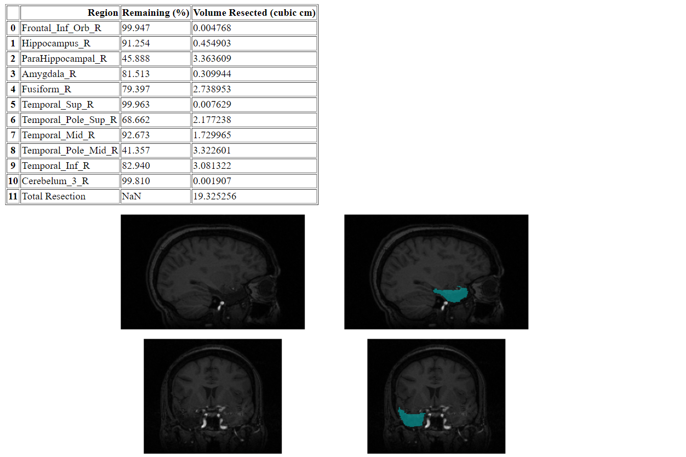
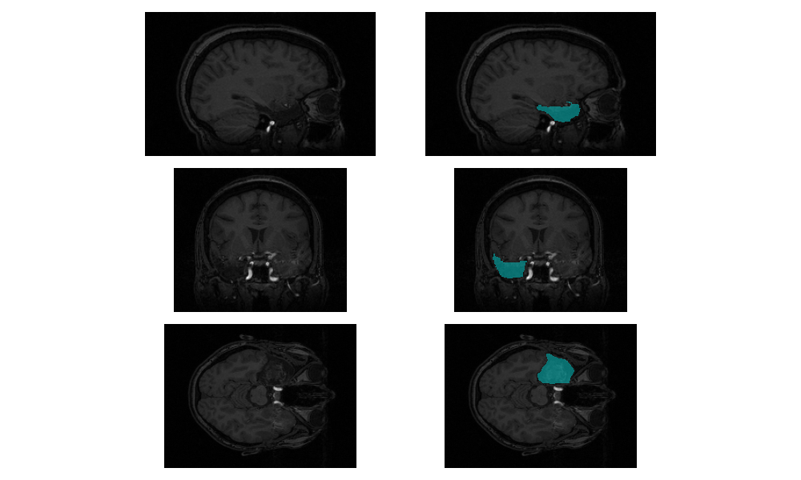
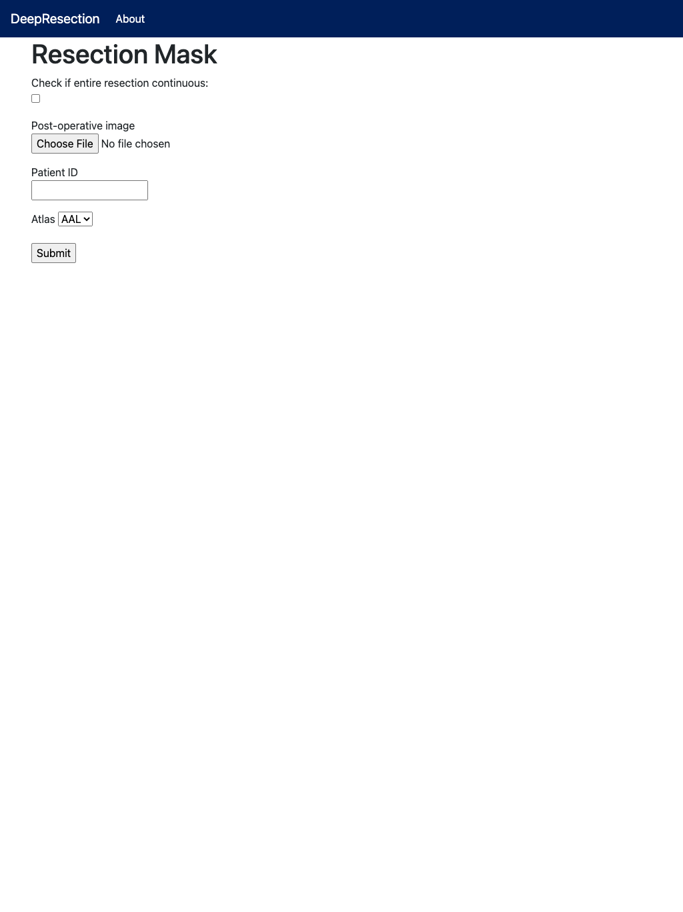

# DeepResection #

[Deep Learning-Based Automated Segmentation of Resection Cavities on Postsurgical Epilepsy MRI](https://www.sciencedirect.com/science/article/pii/S2213158222002194)

T. Campbell Arnold*, Ramya Muthukrishnan*, Akash R. Pattnaik, Adam Gibson, Nishant Sinha, Sandhitsu R. Das, Brian Litt, Dario J, Englot, Victoria L. Morgan, Kathryn A. Davis, Joel M. Stein

*These authors contributed equally

Center for Neuroengineering and Therapeutics, University of Pennsylvania

Deep learning code for neurosurgery resection zone segmentation on T1 MRI, implemented in Keras with Tensorflow backend.

## Prerequisites ##

- Linux OS / Ubuntu

- Python 3.6

- Python package dependencies in `requirements.txt`

- Postoperative (and preoperative) MRI in NIfTI format

## Getting Started ##

Clone the repo: `git clone https://github.com/penn-cnt/DeepResection.git`.

Enter the `DeepResection` directory. Make a `model` directory within the repo using the command `mkdir model`. Then, download the 3 model weights at [this link](https://drive.google.com/drive/folders/1tj8T_aHpeM-4XuQys-CSy3brskkGMf2F?usp=sharing) and save them in the `model` directory as `model/model_axial.h5`, `model/model_coronal.h5`, and `model/model_sagittal.h5`.

## Running the Pipeline ##

Run segmentation only:

`./pipeline/resection_segmentation_only_pipeline.sh patient_name postop_mri.nii output_dir`

Run entire pipeline, including volumetric resection report:

`./pipeline/resection_pipeline.sh patient_name preop_mri.nii postop_mri.nii output_dir`

Run pipeline with deformable registration:

`./pipeline/resection_deformable_pipeline.sh patient_name preop_mri.nii postop_mri.nii output_dir`

## Example outputs ##

### Predicted mask ###

After running the pipeline, the predicted masks in each dimension should be named `predicted_mask_axial.nii.gz`, `predicted_mask_coronal.nii.gz`, and `predicted_mask_sagittal.nii.gz` in the specified output directory. The final predicted mask using majority voting (with 2 votes) is named `predicted_mask.nii.gz` in the output directory. All 4 masks can be opened in an image viewer, such as ITK-Snap, alongside the postoperative input.


### Volumetric resection report ###

If running the full pipeline, the numeric volumetric resection results should be in `output_dir/resected_results.txt`, the HTML report should be in `output_dir/resection_report.html`, and a visualization of the resection should be in `output_dir/resection_views.png`. Examples are shown below.

Text file output:

```
Total resection volume (cubic cm): 19.32525634765625
Frontal_Inf_Orb_R: 99.947% remaining
Hippocampus_R: 91.254% remaining
ParaHippocampal_R: 45.888% remaining
Amygdala_R: 81.513% remaining
Fusiform_R: 79.39699999999999% remaining
Temporal_Sup_R: 99.963% remaining
Temporal_Pole_Sup_R: 68.662% remaining
Temporal_Mid_R: 92.673% remaining
Temporal_Pole_Mid_R: 41.357% remaining
Temporal_Inf_R: 82.94% remaining
Cerebelum_3_R: 99.81% remaining
```

HTML report:



Resection views PNG output:



### Web App ###
A web application is also provided for easy and interactive clinical use. The home page consists of two pipelines: Resection Mask and Volumetric Report.


The resection mask page allows you to select if the mask is continuous and upload the post-operative MRI. The patient ID is used for labeling files and a drop down menu gives the option of different atlases for the report.



If the DeepResection model has already been applied and the mask is given, then the Volumetric Report pipeline generates the report.


The report consists of a table with regions from the selected atlas and estimated resected volume. The widget allows for the user to scan through cross sections of the post-operative MRI and the mask is superimposed in blue. An option to save a PDF of the report is given.


An option for the user to give feedback is given. This feedback will be used to improve the DeepResection pipeline.


