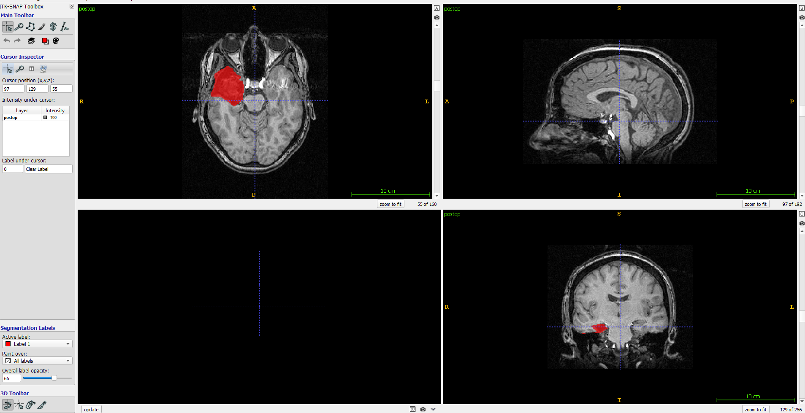

# DeepResection #

Deep Learning-Based Automated Segmentation of Resection Cavities on Postsurgical Epilepsy MRI

T. Campbell Arnold*, Ramya Muthukrishnan*, Akash R. Pattnaik, Adam Gibson, Nishant Sinha, Sandhitsu R. Das, Brian Litt, Dario J, Englot, Victoria L. Morgan, Kathryn A. Davis, Joel M. Stein

*These authors contributed equally

Center for Neuroengineering and Therapeutics, University of Pennsylvania

Deep learning code for neurosurgery resection zone segmentation on T1 MRI, implemented in Keras with Tensorflow backend.

## Prerequisites ##

- Linux OS / Ubuntu

- Python package dependencies in requirements.txt

- Postoperative (and preoperative) MRI in NIfTI format

## Getting Started ##

Clone the repo: `git clone https://github.com/tcama/DeepResection.git`

## Running the Pipeline ##

Run segmentation only:

`./pipeline/resection_segmentation_only_pipeline.sh patient_name postop_mri.nii output_dir`

Run entire pipeline, including volumetric resection report:

`./pipeline/resection_pipeline.sh patient_name preop_mri.nii postop_mri.nii output_dir`

Run pipeline with deformable registration:

`./pipeline/resection_deformable_pipeline.sh patient_name preop_mri.nii postop_mri.nii output_dir`

## Example outputs ##

### Predicted mask ###

After running the pipeline, the predicted mask should be a NIfTI file ending with `predicted_mask.nii` in the specified output directory. It can then be opened in an image viewer, such as ITK-Snap, alongside the postoperative input.

### Volumetric resection report ###

If running the full pipeline, the volumetric results should be 

